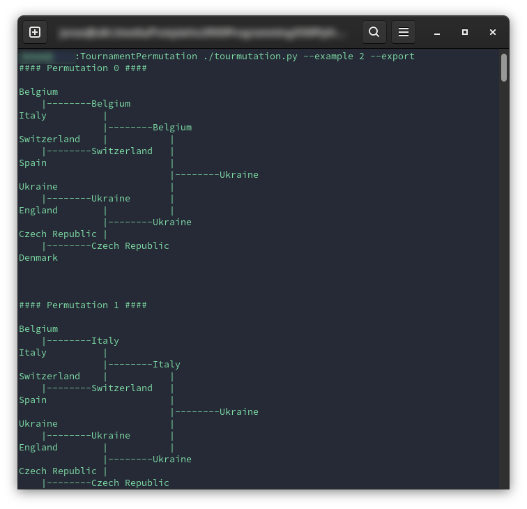

# tourmutation  (Python CLI for calculating all possible permutations)

This is a simple Python CLI to calculate all possible permutations in a knockout competition. 
Optionally the results can be saved as a beautifully formatted txt file (only possible for 4 and 8 competitors).

## How to use
Start the tourmutation.py in the commandline

    Usage: tourmutation.py [OPTIONS]

    Calculate all permutations for a contest.  If you don't specify any of the optional parameters, you can simply select how many contestants your contest has and what your contestants' names are.

    Options:
    --export / --no-export          Do you want an export of the result as txt?  [default: False]

    --example INTEGER               An example with the competiors of the Uefa
                                    2021.  1 = Round of 4  2 = Round of 8  3 = Round of 16  [default: 0]

    --debug / --no-debug            If you want to get the json of the permutations.  [default: False]

    --install-completion [bash|zsh|fish|powershell|pwsh]
                                    Install completion for the specified shell.
    --show-completion [bash|zsh|fish|powershell|pwsh]
                                    Show completion for the specified shell, to copy it or customize the installation.

    --help                          Show this message and exit.

## Example
